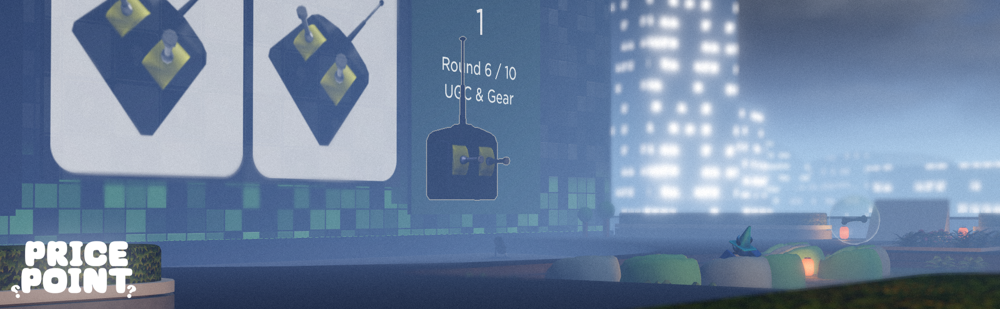

# 💲 Price Point

[Game Link](https://www.roblox.com/games/13085543769/Price-Point)

Price Point is a simple game about guessing the prices of a bunch of items from the Roblox marketplace!

## Goals

- Little or loose coupling between components/systems for modularity.
- To be at a comfortable level of challenging - I specifically wanted to use Price Point as a way to experiment with methodology and concepts in a full game, before I take those learnings and work on bigger projects.

## Technical Details

This project is partially managed using [Rojo](https://rojo.space). No game framework - just plain old requiring modules!

## Takeaways
There's a few interesting things I have noticed that I would like to improve on, even if not for Price Point:

- The file structure could be more organised if things were more structured using folder-by-feature instead of folder-by-type. Folders such as `src/Data` and `src/Util` end up bundling unrelated modules together, which proved to be less convenient to navigate.
- Going forwards my projects will comply with [Roblox's Lua style guide](https://roblox.github.io/lua-style-guide/). I think it's important that a standard is established within the Roblox OSS space, this is likely our best shot!
- Fusion: Hydrating instances twice can cause conflicts with Value objects. Many of Price Point's UI components were doing this to [reduce boilerplate](https://github.com/dphfox/Fusion/issues/206) - many of which have been updated to instead use the methods within [PropsUtil](src/Client/UI/Util/PropsUtil.lua) to avoid this.
